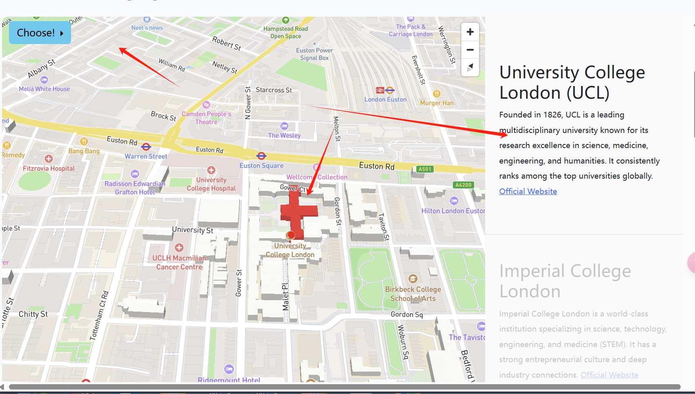
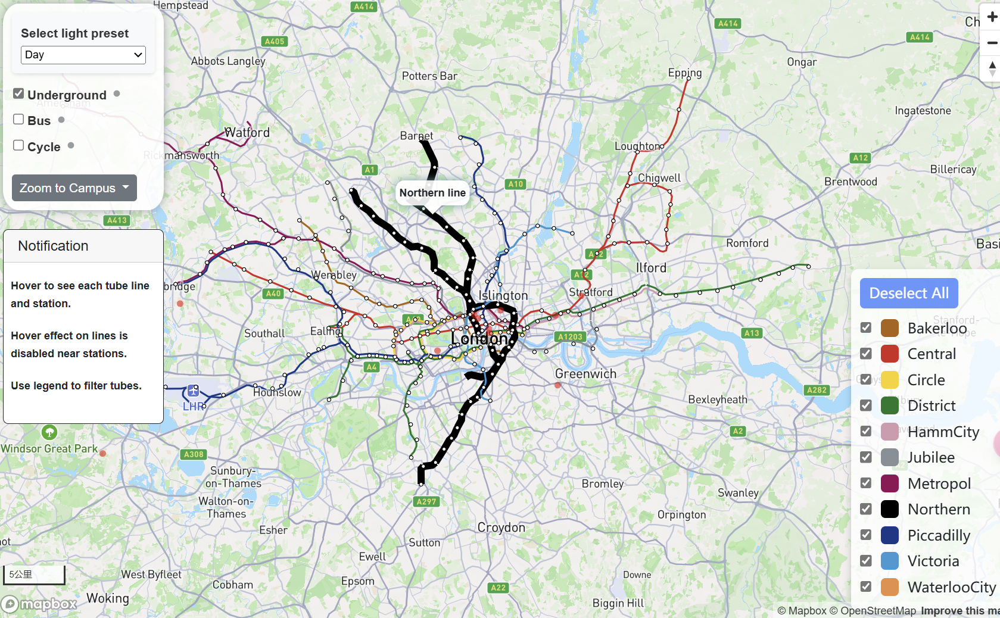
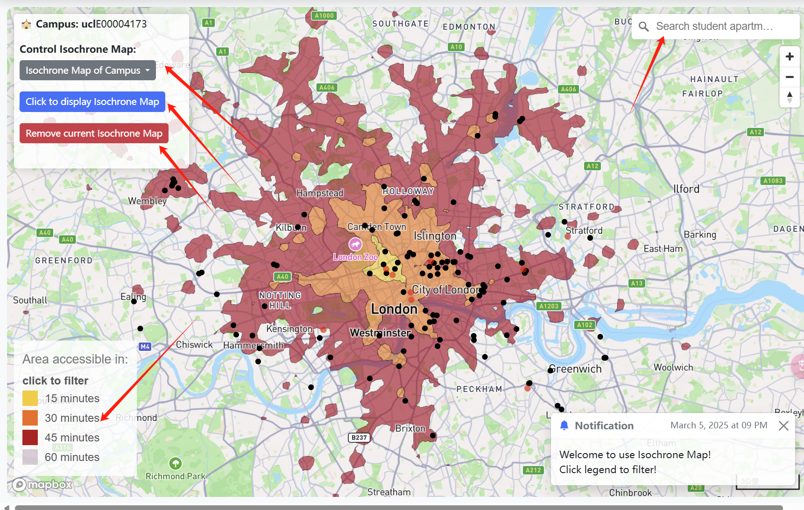
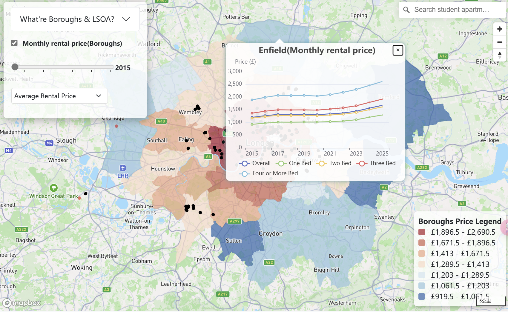

# A short introduction for this project

## [Check this project](https://yyy677.github.io/Individual-Visualisation/)

## Why develop this project?

- To enhance my web development skills and become proficient with WebGIS-related APIs.
- To serve as a foundational base for my graduate design.
- To answer the CASA0003 Mini Project assessment (Individual Visualisation).

## What the visualisation is aiming to show?

This project provides a comprehensive platform for prospective students planning to study in London.
It offers essential insights into various aspects of the city—from transportation networks and commute
times to housing prices—empowering students to make an informed decision about where to live.

> [!IMPORTANT]
> **More aspects will be added in the future.**

## Outline the design and technical approach taken

### Outline the design

This project is a long-scroll website featuring a fixed-top navigation bar. The homepage displays a classic London photograph
with a prominently highlighted fullscreen button. The main content is divided into sections using the `<section>` tag, with map
and icon code separated from the main page and embedded via iframes.

To enhance overall interactivity, the project leverages the Bootstrap library. Additionally, all Mapbox maps in this project
are enriched with extensive interactive features—inviting you to explore.

### Technical approach taken

- HTML5 & CSS3: Basic webpage structure and styling.
- JavaScript: Dynamic interactivity and data processing.
- Mapbox: Mapping library for interactive maps.
- ECharts: Data visualization library.
- Bootstrap: Front-end framework for responsive design.
- Turf.js: Geospatial analysis library for processing and analyzing spatial data.

## Data source

1. [Transport Data](https://gis-tfl.opendata.arcgis.com)
2. [Isochrone Map references this project](https://github.com/pbarber/uk-isochrones-map)
3. [Boroughs property data](https://data.london.gov.uk/dataset/uk-house-price-index)
4. [Boroughs rental data](https://www.ons.gov.uk/economy/inflationandpriceindices/datasets/priceindexofprivaterentsukmonthlypricestatistics)
5. [LSOAs property data](https://www.ons.gov.uk/peoplepopulationandcommunity/housing/datasets/medianpricepaidbylowerlayersuperoutputareahpssadataset46)

## Show

